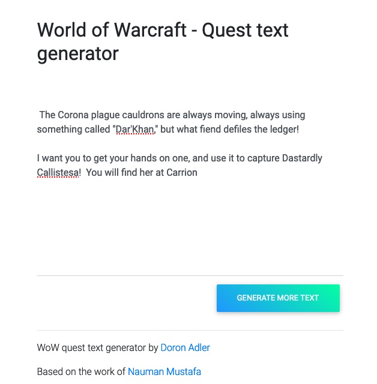

# World of Warcraft - Quest text generator

This repository uses a fine tuned GPT-2 (124M) model to create an [interactive World of Warcraft - Quest text generator](https://gpt-2xy-4ju3cklecq-uc.a.run.app). Just type a few words, hit the button and wait ^_^ 

## Get Started

To get started on this project, follow these steps:

* Clone: `git clone https://github.com/Norod/gpt-2xy.git` and `cd gpt-2xy`
* Install Dependencies: `pip install -r requirements.txt`
* Run server: `python main.py`
* Open Web Browser and visit: `http://localhost:8080/`
* Type `Hello there` and press on `GENERATE MORE TEXT`
* Enjoy!

You may also want to build and run this project in docker container

* Build: `docker build -t gpt-2xy .` (will take some time)
* Run: `docker run -p 8080:8080 --rm -d gpt-2xy`

If successful, you will see something like this:

## An awesome Tutorial

This repository is based upon the code of the following Medium tutorial: [Deploy Machine Learning Model in Google Cloud using Cloud Run](https://medium.com/@NaxAlpha/deploy-machine-learning-model-in-google-cloud-using-cloud-run-6ced8ba52aac)
